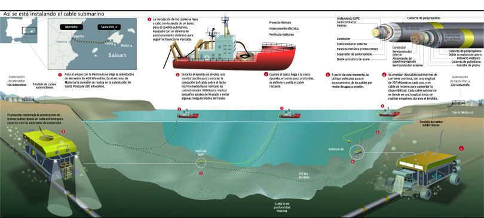

# Seguretat digital
Informació i eines per protegit la privacitat
___

## Bones!
* Tallerista: m.descalzo.perez@sindomino.net
  * Conté informació del [Hacklab Logout](https://sindominio.net/logout/)
* Llicència: [CC - Reconeixement i Compartir igual](https://creativecommons.org/licenses/by-sa/4.0/deed.ca)
___
## Continguts
* Com funciona internet? I la xarxa mòbil?
* Grans empreses i vigilància
* Eïnes per a protegir-nos
---

# Com funciona internet?


___

## Què forma internet...?

### Coses que hem sentit
___

### Satèl·lits!


___

### Antenes!


___

### "Energia"


___

_Hi ha una mica de veritat en tots, però sobretot tenim_

* Fibra òptica terrestre
* Fibra òptica marítima
* Centres d'interconnexió d'operadores
* Centres de dades / granges de servidors
* Mòdems òptics
* Routers, switchs, brigdes
___

### Fibra òptica per vies de tren I


___

### Fibra òptica per vies de tren II


___

### Fibra òptica per carreteres i autopistes


___

### Fibra òptica per clavegueram


___

### Fibra aèria (amb teixit elèctric)


___

### Fibra aèria d'accés final


___

#### Reintel (red eléctrica i adif) - 50m km
[](https://www.reintel.es/es/infraestructuras/mapa-red)
___

#### Lyntia (gas natural, endesa, iberdrola) - 40m km

[](https://www.lyntia.com/red-fibra-optica/)
___

### Esquema d'instal·lació
(cable submarí elèctric, no de fibra)




___

### Cable en el terra marí


___

### Cable reparat en el vaixell


___
### Bobina de cable en el vaixell instal·lador


___

### Cable arriba a la platja


___


___

### Mapes de cables submarins
___

#### Telefònica

[](https://www.wholesale.telefonica.com/en/about/international-network/)

___

#### Telxius


___

#### Mapa Atlàntic Europeu

[](https://www.submarinecablemap.com/)

___

#### Mapa Mediterrani

[](https://www.submarinecablemap.com/)
___


## Equipaments
___

### Centraletes


_Estacions base de Movistar al centre de Barcelona_
___
### Estacions base de telefonia


_Estació base de tres ceŀles_
___
### I més...
Punts d'interconnexió

Centres de dades

Routers i switchs

Mòdems
---

## Servidors
...que son?


___

* Un ordinador (o molts!) connectat a internet
* Atén peticions d'altres ordenadors (clients)
* Ofereixen serveis (ex: missatgeria)
___

### I el núvol...
Son els ordinadors d'altres persones/empreses

Emmagatzemen dades
___

## De qui son els servidors?
___

### Grans empreses


___

Però també...
* Servidors autogestionats
* Alternatives no globalitzades
* Qualsevol persona?
___

### Big Tech...
  * Genera riquesa privada
  * Als països més desenvolupats
  * Recursos centralitzats
___

#### Electrònica, consumisme i BigTech
* Genera una gran "petjada ecològica"
* Utilitzar i llençar!
* 5G, Internet of Things, Smart cities...
___

### I al Sud global
  * Espoli de la riquesa natural
  * Treballs infrahumans i mortífers
  * Subjugació a les més riques
  * Dificultats per accedir a internet
___
## Com es lucren les GAFAM?

* Moltes plataformes
* Molt addictives
  * Anuncis personalitzats
  * Venda d'informació (_data generation_)

___
## Com es lucren les GAFAM?
```
"Si quelcom és gratuït, tu ets el producte"
```

___

### Plataformes socials
- Addictives/depressives
- Privacitat i mineria de dades
- Treball gratuït
- Àgora pública sí, però com?

*Facebook, Netflix*
___
### Codi privatiu com a problema de seguretat

- Windows → GNU-Linux
  (linux mint/ xubuntu / manjaro)
- Whatsapp → Signal, Element
- Gmail → Riseup, Sindominio
- PlayStore → F-Droid + AuroraStore
- Chrome → Firefox
- GMaps → OpenStreetMaps / OsmAnd
- Zoom/Skype → Jitsi / Big Blue Button
- Chess.com → lichess.org ;)

---
# Seguretat a internet
___

### Perquè és important?
* Control de masses
* Control de "sospitosos"
* Manca de privacitat
* Impossibilitat de subversió
* Mals psicològics deguts al control

* Més dades => Menys control
  * De les grans corporacions, l'estat o assetjadors
___

### Perills
  * Metadades incrustades (pdf, fotos, vídeos, etc)
  * La xarxa de seguidores m’identifica
  * El patró horari em delata
  * Repeteixo expressions o faltes d’ortografia concretes
  * <p class="fragment highlight-red">Telefonia mòbil</p>

___
### Qui son els «dolents»?
* La poli (físico o remoto)
* ISPs
* GAFAM / BATX
* Malfactors informàtics
* Assetjadors
___

### Comoditats i beneficis
Hem de valorar si volem fer servir:
  1. Eines _main stream_ menys segures
  2. Eines més segures
  3. No fer-les servir (evita mals de caps)
___

# Recull d'eines!
___
### Xat: Signal

___
### Anonimat a la xarxa: Tor

___
## Navegació Anònima: RiseUPVPN

___
## Complements per Firefox


___
#### HTTPS Everywhere


* Prova la comunicació xifrada (HTTPS) si el servidor la suporta.
* Té un mode de bloquejar totes les connexions per HTTP sense xifrar.
* [Descarrega'l](https://addons.mozilla.org/ca/firefox/addon/https-everywhere/)

___
#### uBlock Origin


* Bloqueja els anuncis de manera eficient i permet crear els teus propis filtres
* [Descarrega'l](https://addons.mozilla.org/ca/firefox/addon/ublock-origin/)

___
#### Cookie-AutoDelete

* Destrueix les cookies de qualsevol pestanya que no tinguis oberta
* [Descarrega'l](https://addons.mozilla.org/ca/firefox/addon/cookie-autodelete/)

___
#### Privacy badger


* Bloqueja els continguts de tercers que tinguin l'objectiu de rastrejar
* [Descarrega'l](https://addons.mozilla.org/en-US/firefox/addon/privacy-badger17/)
___

### TAILS


___
### Gestió de credencials: KeepassX


___
### Xifrar dispositus
Es fàcil i divertit!
* Mòbils
* Pens/Discs durs externs
* Ordinadors
___
##### Veracrypt:
Link: https://www.veracrypt.fr/en/Downloads.html

---
### Això es tot!
Més info al web de [Hacklab Logout](https://sindominio.net/logout/)

Gràcies per la vostra atenció ❤️

---
# Missatgeria per Whatsapp
___
Creació de Claus d'encriptació


___
Inici de la conversa


___
Rebuda dels missatges pendents


___
ACK!


